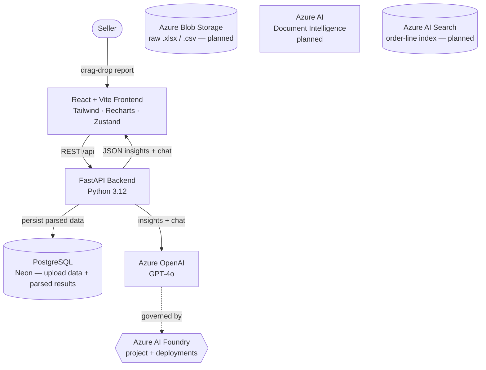

# SellerLens

> **AI-powered profit intelligence for Indian e-commerce sellers, built on Azure AI Foundry.**

**Microsoft Build AI Hackathon 2026 · Theme 04 — AI Meets Data**

---

## 1. Problem Statement

Indian Flipkart sellers receive **multi-sheet settlement workbooks with 50+ columns** every payout cycle. Returns, marketplace fees, GST, TCS/TDS, reverse-shipping charges, and ad spend are spread across separate tabs. There is no way to see **true profit per SKU** without hours of manual Excel work, and most sellers simply trust the platform's "net settlement" line — leaving reclaimable GST credits, ad-spend waste, fee anomalies, and loss-making SKUs invisible. **SellerLens turns those reports into instant, AI-driven decisions.**

## 2. Solution Overview

1. **Upload** a Flipkart `.xlsx` settlement report (drag-drop, up to 50 MB).
2. **Auto-parse** structure with a tolerant pandas pipeline that handles column-name drift across statement versions.
3. **Profit engine** computes per-SKU net settlement, return rate, and margin after every fee, tax, and reverse-shipping deduction.
4. **Ads Analytics** — per-SKU ad spend is reconciled against settlement revenue to surface loss-making promoted products, top ROAS performers, and reclaimable GST input credits on ad costs.
5. **AI insights** — Azure OpenAI (GPT-4o) generates 5 ranked, actionable findings with rupee impact and a 0–100 health score.
6. **Chat with your data** — natural-language Q&A grounded in the seller's own numbers, with follow-up suggestions and source-data citations.
7. **Multi-period trends** — select 2–6 previously uploaded reports for period-over-period analysis, SKU-level decline detection, and an AI trend narrative.

## 3. Azure AI Stack

| Service | Status | Purpose |
| --- | --- | --- |
| **Azure OpenAI (GPT-4o)** | ✅ Active | Generates the 5-insight report, ad analytics narrative, and powers the chat agent (with retry/backoff and a rule-based fallback). |
| **Azure AI Foundry** | ✅ Active | Project hosting and model deployment for GPT-4o. |
| **Azure AI Document Intelligence** | ⚙️ Code ready, env not configured | Auto-detects sheet layouts in Flipkart/Amazon workbooks. **Fallback active:** tolerant pandas pipeline handles column-name drift until credentials are added. |
| **Azure Blob Storage** | ⚙️ Code ready, env not configured | Encrypted per-seller storage for raw uploaded files. **Fallback active:** files parsed in memory; `blob_url` stored as empty string. |
| **Azure AI Search** | ⚙️ Code ready, env not configured | Indexed order-line embeddings for semantic chat retrieval. **Fallback active:** chat uses in-prompt seller data until credentials are added. |
| **Microsoft Entra ID SSO** | ⚙️ Code ready, app registration pending | OAuth2 sign-in via MSAL. Button visible in UI, non-functional until app registration is approved. |

## 4. Architecture



## 5. Try the Live Demo

The app is deployed at **[https://jainsamarth07-sellerlens.vercel.app](https://jainsamarth07-sellerlens.vercel.app)**

### Test credentials (pre-loaded with data)

| Field | Value |
| --- | --- |
| **Email** | `sellerflipkart@sellerlens.com` |
| **Password** | `sellerflipkart@1` |

This account has a real Flipkart settlement report already uploaded — you can explore the dashboard, AI insights, ads analytics, and chat features immediately without uploading anything.

### New sign-up

Creating a new account via **Sign Up** will start an **interactive product tour** that walks you through every feature step by step.

### Microsoft sign-in

The **"Continue with Microsoft"** button is visible but **not yet functional** — the OAuth2 flow is fully implemented (MSAL for Python, Microsoft Graph API) but the Entra app registration is pending approval. Use email/password sign-in for now.

---

## 6. Environment Variables

### Active in production

| Variable | Description |
| --- | --- |
| `AZURE_OPENAI_ENDPOINT` | Azure OpenAI resource endpoint |
| `AZURE_OPENAI_API_KEY` | Azure OpenAI API key |
| `AZURE_OPENAI_DEPLOYMENT_NAME` | GPT-4o deployment name (default: `gpt-4o`) |
| `AZURE_OPENAI_API_VERSION` | API version (default: `2024-12-01-preview`) |
| `DATABASE_URL` | PostgreSQL connection string (Neon in production) |
| `CORS_ORIGINS` | Comma-separated allowed frontend origins |
| `JWT_SECRET` | HS256 secret for signing auth tokens |
| `APP_ENV` | `production` or `development` |

### Code ready — credentials not yet added (app runs fine without them)

| Variable | Service | Fallback behaviour |
| --- | --- | --- |
| `AZURE_DOCUMENT_INTELLIGENCE_ENDPOINT` | Azure Document Intelligence | Pandas parser used instead |
| `AZURE_DOCUMENT_INTELLIGENCE_KEY` | Azure Document Intelligence | Same as above |
| `AZURE_STORAGE_CONNECTION_STRING` | Azure Blob Storage | Files parsed in memory; `blob_url` stored as empty string |
| `AZURE_STORAGE_CONTAINER_NAME` | Azure Blob Storage | Default: `seller-uploads` |
| `AZURE_AI_SEARCH_ENDPOINT` | Azure AI Search | Chat grounded on in-prompt data |
| `AZURE_AI_SEARCH_KEY` | Azure AI Search | Same as above |
| `AZURE_AI_SEARCH_INDEX_NAME` | Azure AI Search | Default: `seller-data-index` |

### Microsoft Entra ID SSO — implemented, pending app registration

| Variable | Description |
| --- | --- |
| `MICROSOFT_CLIENT_ID` | From Entra ID App Registration |
| `MICROSOFT_CLIENT_SECRET` | From Entra ID App Registration |
| `MICROSOFT_TENANT_ID` | `common` for personal + work accounts |
| `MICROSOFT_REDIRECT_URI` | `https://<backend-url>/api/auth/microsoft/callback` |

---

## 7. Local Setup

**Prerequisites:** Python 3.12+, Node 18+, an Azure subscription with OpenAI access.

```bash
# 1. Clone
git clone https://github.com/jainsamarth07/sellerlens.git
cd sellerlens

# 2. Configure environment
cp .env.example .env   # fill in AZURE_OPENAI_* and DATABASE_URL at minimum

# 3. Backend
python -m venv .venv
source .venv/bin/activate          # Windows: .venv\Scripts\activate
pip install -r requirements.txt
alembic upgrade head               # create DB tables
uvicorn backend.main:app --reload  # http://localhost:8000

# 4. Frontend (new terminal)
cd frontend
npm install
npm run dev                        # http://localhost:3000
```

**Run tests:** `pytest -q` (69 tests, hermetic — no Azure calls required).

### Run with Docker (one command)

```bash
cp .env.example .env       # fill in Azure credentials
docker compose up --build  # backend :8000, frontend :3000, postgres :5432
```

| Service | Image | Port | Notes |
| --- | --- | --- | --- |
| `db` | `postgres:16-alpine` | 5432 | Persistent volume `db_data`, healthcheck via `pg_isready` |
| `backend` | `Dockerfile.backend` (Python 3.12-slim) | 8000 | Runs as non-root, `/health` healthcheck, reads `.env` |
| `frontend` | `Dockerfile.frontend` (Vite build → nginx) | 3000 | nginx proxies `/api/*` → `backend:8000`, 60 MB upload limit |

Stop with `docker compose down`; add `-v` to also wipe the database volume.

## 8. Key Features (Live)

- **4-step upload flow** with animated pipeline progress and confetti success state
- **Dashboard** — 4 KPI cards, revenue/settlement bar chart, donut showing where every rupee went, full settlement waterfall, sortable SKU table
- **Ads Analytics** — per-SKU ad spend vs. profit, loss-making promoted products highlighted in red, top ROAS winners, reclaimable GST input credits; AI summary with rupee-impact findings
- **AI Insights panel** — 5 ranked cards (warning / opportunity / info), each with rupee impact and a recommended action
- **Chat** — message bubbles, follow-up suggestion buttons, sticky session, "Powered by Azure OpenAI" attribution
- **Compare Months** — select 2–6 previously uploaded periods, line-chart trends, side-by-side metric table, AI trend narrative
- **Indian-format currency** (₹1,23,456 grouping) throughout
- **Cross-device persistence** — settlement data stored in DB and restored on login from any browser

## 9. AI Tools Used in Development

| Tool | Where it helped |
| --- | --- |
| **GitHub Copilot** | Boilerplate scaffolding for FastAPI routers, React components, and pytest fixtures. |
| **Azure OpenAI (GPT-4o)** | Core product feature — insight generation, chat, multi-period trend narrative. |
| **Claude (Anthropic)** | Architecture planning, prompt-engineering iterations, and end-to-end code review. |

## 10. Repository Layout

```
sellerlens/
├── backend/
│   ├── api/            # FastAPI routers: upload, analytics, ads, chat, multi_period, health
│   ├── services/       # azure_openai_service, chat_service, multi_period_analyzer, storage
│   ├── processors/     # flipkart_parser, settlement_parser, profit_calculator
│   └── models/         # SQLAlchemy ORM
├── frontend/
│   └── src/            # pages/ + components/ + lib/ + store/  (React 18 + Vite + Tailwind)
├── alembic/            # DB migrations
├── tests/              # 69 pytest tests (parsers, AI engine, chat, ads analytics)
├── Dockerfile.backend
├── Dockerfile.frontend
├── docker-compose.yml
└── render.yaml
```

## 11. Team

| Name | Role | Contact |
| --- | --- | --- |
| Samarth Jain | Full-stack & AI engineering | https://www.linkedin.com/in/samarth-jain-5018621bb |
| Cheshta Satija | Full-stack & AI engineering | https://www.linkedin.com/in/cheshta-satija-9b9759199 |

## 12. Theme

**Theme 04 — AI Meets Data.** SellerLens turns the most ignored data asset in Indian e-commerce — the monthly settlement report — into a conversational, action-oriented profit copilot, end-to-end on Azure AI Foundry.

---

_Built for Microsoft Build AI Hackathon 2026._
