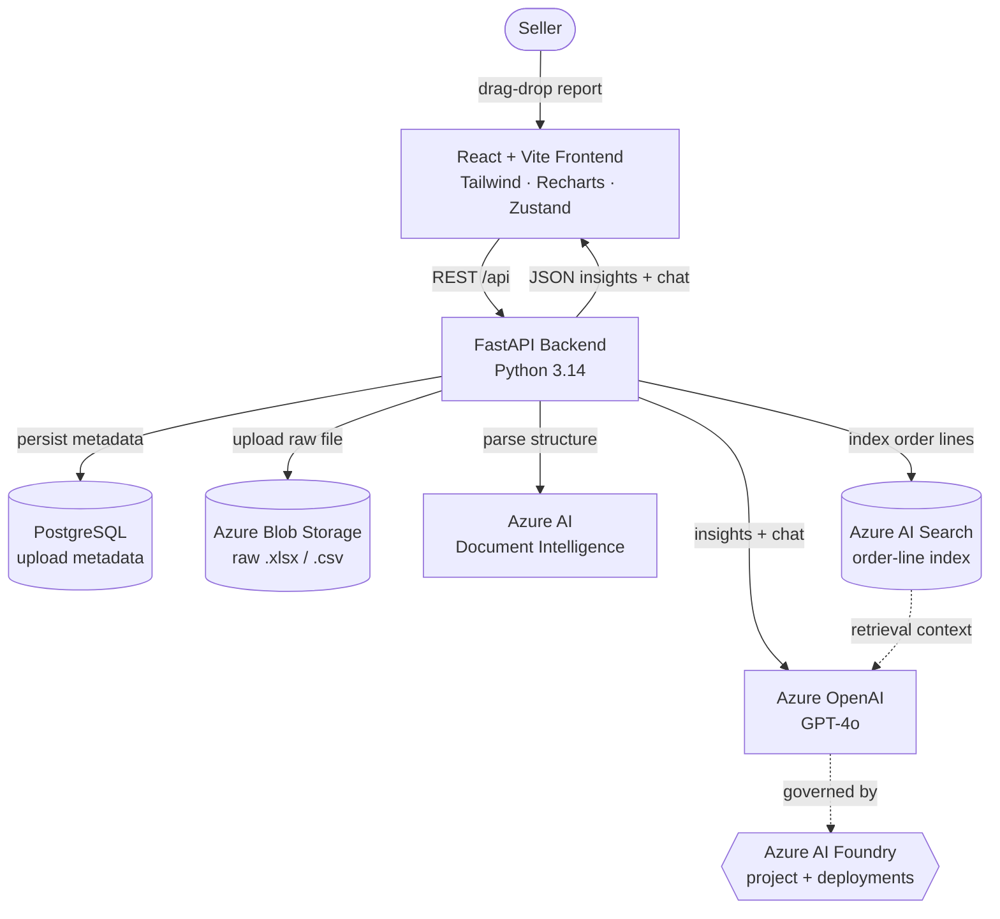

# SellerLens

> **AI-powered profit intelligence for Indian e-commerce sellers, built on Azure AI Foundry.**

**Microsoft Build AI Hackathon 2026 · Theme 04 — AI Meets Data**

---

## 1. Problem Statement

Indian Amazon and Flipkart sellers receive **multi-sheet settlement workbooks with 50+ columns** every payout cycle. Returns, marketplace fees, GST, TCS/TDS, reverse-shipping charges, and ad spend are spread across separate tabs. There is no way to see **true profit per SKU** without hours of manual Excel work, and most sellers simply trust the platform's "net settlement" line — leaving reclaimable GST credits, fee anomalies, and loss-making SKUs invisible. **SellerLens turns those reports into instant, AI-driven decisions.**

## 2. Solution Overview

1. **Upload** a Flipkart `.xlsx` or Amazon `.csv` settlement report (drag-drop, up to 50 MB).
2. **Auto-parse** structure with Azure Document Intelligence + a tolerant pandas pipeline that handles column-name drift across statement versions.
3. **Profit engine** computes per-SKU net settlement, return rate, and margin after every fee, tax, and reverse-shipping deduction.
4. **AI insights** — Azure OpenAI (GPT-4o) generates 5 ranked, actionable findings (e.g. *"Reclaim ₹28,967 in GST input credits before the 20-Jun deadline"*) with rupee impact and a 0–100 health score.
5. **Chat with your data** — natural-language Q&A grounded in the seller's own numbers, with follow-up suggestions and source-data citations.
6. **Multi-period trends** — drop in 2–6 months of reports for period-over-period analysis, SKU-level decline detection, and an AI trend narrative.

## 3. Azure AI Stack

| Service | Purpose | Why we chose it |
| --- | --- | --- |
| **Azure AI Foundry** | Project hosting, model deployment, and prompt-flow management for GPT-4o. | Single control plane for model versioning, evaluations, and safety filters — critical for shipping a financial assistant. |
| **Azure OpenAI (GPT-4o)** | Generates the 5-insight report and powers the chat agent (with retry/backoff and a deterministic rule-based fallback). | GPT-4o's JSON mode + multilingual support handles Hindi/English seller queries reliably; latency fits a sub-30 s upload flow. |
| **Azure AI Document Intelligence** | Auto-detects sheet layouts and column groupings in Flipkart/Amazon workbooks that change between payout cycles. | Removes brittle hardcoded headers; gives the parser resilience to format drift without retraining. |
| **Azure Blob Storage** | Encrypted storage of raw uploads (per-seller container, UUID-prefixed blobs). | Compliance-ready (SOC 2, ISO 27001), private endpoints, and lifecycle rules to auto-expire raw files. |
| **Azure AI Search** | Indexed order-line embeddings for semantic retrieval inside the chat agent. | Vector + hybrid keyword search lets sellers ask *"why did SKU-001 lose money in April?"* and get the right rows back. |

## 4. Architecture



**Text flow:**

```
[Seller] → [React Frontend]
                ↓
         [FastAPI Backend]
        /        |          \
[Doc Intelligence][Azure OpenAI][PostgreSQL]
        \        |          /
         [Azure Blob Storage]
              [Azure AI Foundry]
              [Azure AI Search]
```

## 5. Setup

**Prerequisites:** Python 3.11+, Node 18+, an Azure subscription with OpenAI access.

```bash
# 1. Clone
git clone https://github.com/<you>/sellerlens.git
cd sellerlens

# 2. Configure Azure credentials
cp .env.example .env       # fill: AZURE_OPENAI_*, AZURE_STORAGE_*, AZURE_SEARCH_*

# 3. Backend
python -m venv .venv
.\.venv\Scripts\Activate.ps1            # macOS/Linux: source .venv/bin/activate
pip install -r requirements.txt
uvicorn backend.main:app --reload       # http://localhost:8000

# 4. Frontend (new terminal)
cd frontend
cp .env.example .env
npm install
npm run dev                             # http://localhost:3000

# 5. Try it
# Visit http://localhost:3000 → /upload → drop a Flipkart .xlsx
# (Don't have one? Click "Download sample Flipkart template" on the upload page.)
```

**Run tests:** `pytest -q` (69 tests, hermetic — no Azure calls required).

### Run with Docker (one command)

```bash
cp .env.example .env       # fill in Azure credentials
docker compose up --build  # backend :8000, frontend :3000, postgres :5432
```

The compose stack builds three services:

| Service | Image | Port | Notes |
| --- | --- | --- | --- |
| `db` | `postgres:16-alpine` | 5432 | Persistent volume `db_data`, healthcheck via `pg_isready` |
| `backend` | `Dockerfile.backend` (Python 3.12-slim) | 8000 | Runs as non-root, `/health` healthcheck, reads `.env` |
| `frontend` | `Dockerfile.frontend` (Vite build → nginx) | 3000 | nginx proxies `/api/*` → `backend:8000`, 60 MB upload limit |

Stop with `docker compose down`; add `-v` to also wipe the database volume.

## 6. Key Features (Live)

- **4-step upload flow** with animated pipeline progress (`upload → read → parse → profit → insights`) and confetti success state
- **Dashboard** — 4 KPI cards, revenue/settlement bar chart, donut showing where every rupee went, full settlement waterfall, sortable SKU table
- **AI Insights panel** — 5 ranked cards (warning / opportunity / info), each with rupee impact and a recommended action
- **Chat** — message bubbles, `data_used` chips, follow-up suggestion buttons, sticky session, "Powered by Azure OpenAI" attribution
- **Compare Months** — 2–6 file upload, line-chart trends, side-by-side metric table, AI trend narrative
- **Indian-format currency** (₹1,23,456 grouping) throughout

## 7. AI Tools Used in Development

| Tool | Where it helped |
| --- | --- |
| **GitHub Copilot** | Boilerplate scaffolding for FastAPI routers, React components, and pytest fixtures. |
| **Azure OpenAI (GPT-4o)** | Core product feature — insight generation, chat, multi-period trend narrative. |
| **Claude (Anthropic)** | Architecture planning, prompt-engineering iterations, and end-to-end code review. |

## 8. Repository Layout

```
analytics/
├── backend/
│   ├── api/            # FastAPI routers: upload, analytics, chat, multi_period, health
│   ├── services/       # azure_openai_service, chat_service, multi_period_analyzer, storage, sample_data, upload_jobs
│   ├── processors/     # flipkart_parser, amazon_parser, settlement_parser, profit_calculator
│   └── models/         # SQLAlchemy ORM
├── frontend/
│   └── src/            # pages/ + components/ + lib/ + store/  (React 18 + Vite + Tailwind)
├── tests/              # 69 pytest tests (parsers, AI engine, chat, multi-period, upload pipeline)
└── README.md
```

## 9. Team

| Name | Role | Contact |
| --- | --- | --- |
| Samarth Jain | Full-stack & AI engineering | https://www.linkedin.com/in/samarthjain |

## 10. Theme

**Theme 04 — AI Meets Data.** SellerLens turns the most ignored data asset in Indian e-commerce — the monthly settlement report — into a conversational, action-oriented profit copilot, end-to-end on Azure AI Foundry.

---

_Built for Microsoft Build AI Hackathon 2026._


## Microsoft Authentication

SellerLens supports two sign-in paths. **Microsoft Entra ID SSO is the primary, recommended option** for hackathon participants.

- **App registered in Microsoft Entra ID** as `SellerLens`
- **OAuth2 authorization-code flow** implemented with **MSAL for Python**
- **Microsoft Graph API** (`GET /v1.0/me`) used to fetch the signed-in user's display name and email after consent
- Supports both **personal Microsoft accounts** (outlook.com, hotmail.com, live.com) and **work / school accounts**

### How it works

1. Frontend calls `GET /api/auth/microsoft/login` to get the authorization URL (with a CSRF `state` token).
2. Browser is redirected to Microsoft, the user signs in and consents to the `User.Read` scope.
3. Microsoft redirects back to `GET /api/auth/microsoft/callback?code=...&state=...`.
4. Backend exchanges the code for an access token via MSAL, fetches the Graph profile, upserts the user into the `users` table, and issues a **7-day HS256 JWT**.
5. The JWT is appended to the frontend callback URL as a **URL hash fragment** (`#token=...`) so it never reaches any server access log.
6. Every subsequent API request carries `Authorization: Bearer <jwt>`; every database query is scoped by `user_id` extracted from that JWT.

### Email / password (fallback)

Users without a Microsoft account can sign up with `POST /api/auth/signup` � passwords are hashed with **bcrypt (12 rounds)**.

### Required environment variables

```
JWT_SECRET=<random 48-byte secret>
MICROSOFT_CLIENT_ID=<from Entra App Registration>
MICROSOFT_CLIENT_SECRET=<from Entra App Registration>
MICROSOFT_TENANT_ID=common
MICROSOFT_REDIRECT_URI=http://localhost:8000/api/auth/microsoft/callback
```

This demonstrates **Azure AI Foundry + Azure OpenAI + Microsoft Entra ID** � three Microsoft services in one product.
